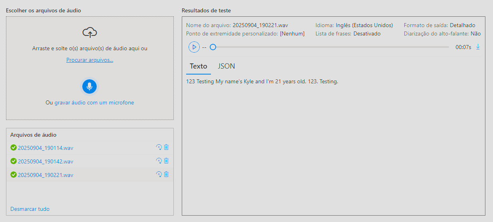

# Azure Speech Studio
O Azure Speech Studio é uma plataforma online da Microsoft que permite criar, testar e personalizar soluções de fala com base no serviço de Fala do Azure (Azure Speech Service), sem a necessidade de escrever código

## Principais funcionalidades
- Reconhecimento de fala (Speech-to-text)
  Converte áudio em texto em tempo real ou a partir de arquivos gravados.
  Pode ser personalizado para vocabulários específicos (ex: termos técnicos ou nomes próprios).
  
- Tradução de fala (Speech Translation)
  Traduz fala entre diferentes idiomas automaticamente, combinando reconhecimento e tradução.

- Identificação e verificação do locutor
  Reconhece quem está falando, útil para autenticação por voz ou diferenciação de participantes.

## Explorando as funcionalidades
Aqui serão documentados os passos feitos dentro da plataforma e os resultados obtidos quando utilizadas certas funcionalidades do Speech Studio

Foram feitos três testes dentro da função Speech-to-text, onde os três consistiam em utilizar o microfone para captar minha voz e o Speech Studio transcrever em texto. O primeiro teste foi realizado em Português do Brasil (PT-BR), e o segundo e terceiro teste foram realizados em inglês dos Estados Unidos (EN-US). Abaixo terão imagens que mostram os resultados obtidos em cada teste.

Neste primeiro teste é possível observar que o idioma utilizado foi o Português do Brasil, e o texto foi transcrito perfeitamente a partir do audio obtido do microfone.

No segundo teste utilizei uma abordagem diferente, onde troquei o idioma para inglês, porém mantive o audio em português, e o resultado foi, de forma esperada, um fracasso. É apresentada uma mistura de palavras sem sentido, onde o Speech Studio tenta identificar palavras em inglês e apresentar talvez os melhores resultados a partir da análise feita.

No terceiro e último teste, o idioma do áudio e da análise estão correspondentes, resultando assim em 100% de precisão em relação ao primeiro teste, onde o que é dito é o mesmo, porém em inglês. A única divergência apresentada é a mudança do nome "Caio" para "Kyle", mudança essa esperada, levando em consideração o sotaque e que seria uma versão em inglês do nome apresentado em português.
  

# Azure Language Studio
O Azure Language Studio é uma plataforma online da Microsoft que permite explorar, testar e personalizar recursos de linguagem natural (NLP) oferecidos pelo serviço de Linguagem de IA do Azure, tudo por meio de uma interface visual e intuitiva — sem necessidade de programar.

## Principais funcionalidades
- Análise de sentimento e opinião
  Identifica se o texto expressa emoções positivas, negativas ou neutras e pode extrair opiniões específicas (ex: sobre produtos ou serviços).

- Reconhecimento de entidades nomeadas (NER)
  Detecta nomes de pessoas, locais, organizações, datas, valores, entre outros.

- Detecção de idioma
  Identifica automaticamente em qual idioma um texto foi escrito
  
## Explorando as funcionalidades
Aqui serão documentados os passos feitos dentro da plataforma e os resultados obtidos quando utilizadas certas funcionalidades do Language Studio

Foram feitos testes voltados as funções de Análise de sentimento e opinião e Detecção de idioma. O teste de Análise de sentimento retornam resultados satisfatórios, onde, a partir de um texto, o Language Studio conseguiu retornar o resultado com ótima precisão, analisando bem aquilo que o redator da mensagem gostaria de passar. Na detecçãp de idioma, o resultado também é bem próximo do esperado, porém quando se trata de mais de um idioma na mesma mensagem, a detecção capta apenas o idioma predominante, ou seja, ignora os demais idiomas ali presentes. Abaixo seguem imagens referenciando os resultados dos testes.
